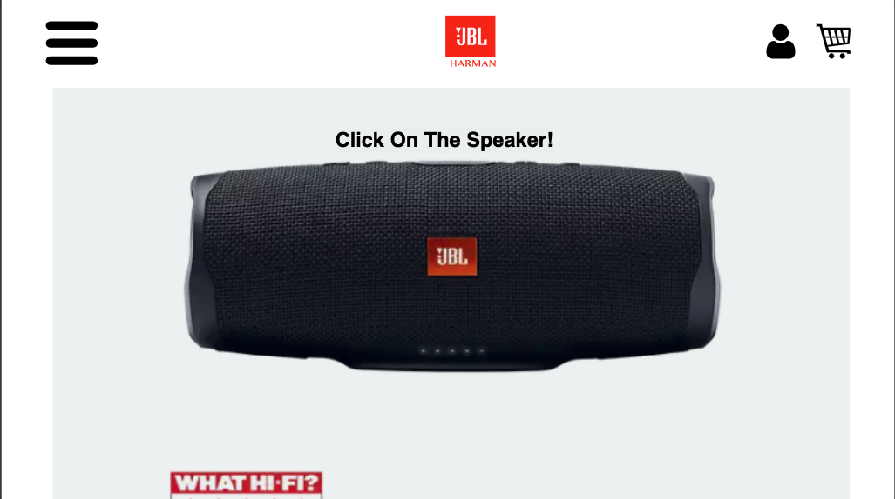
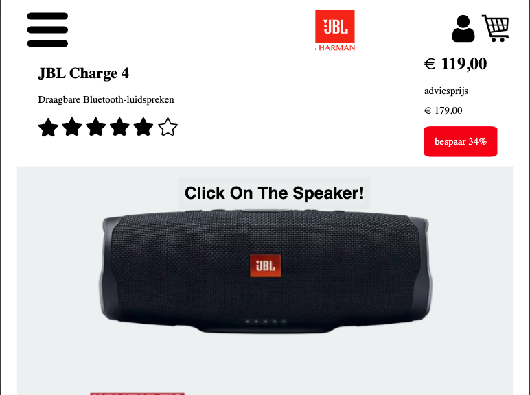
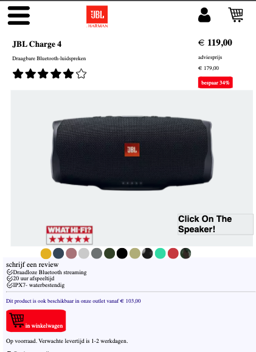
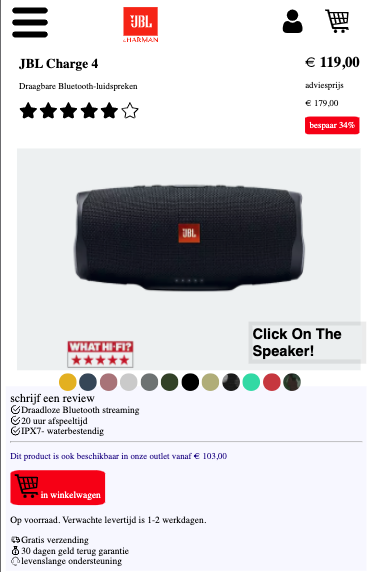
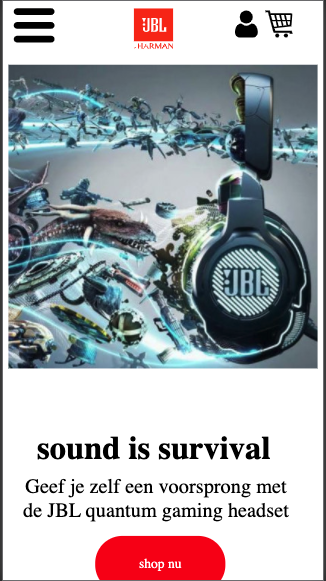
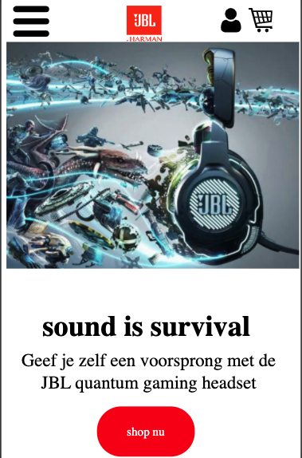
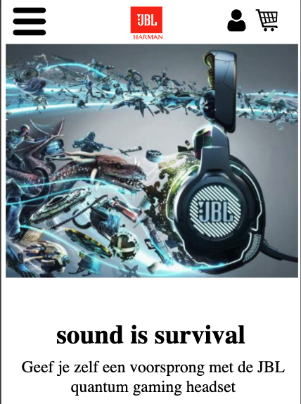
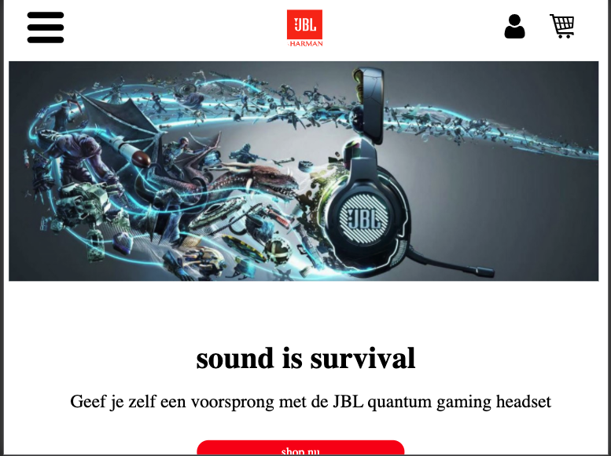
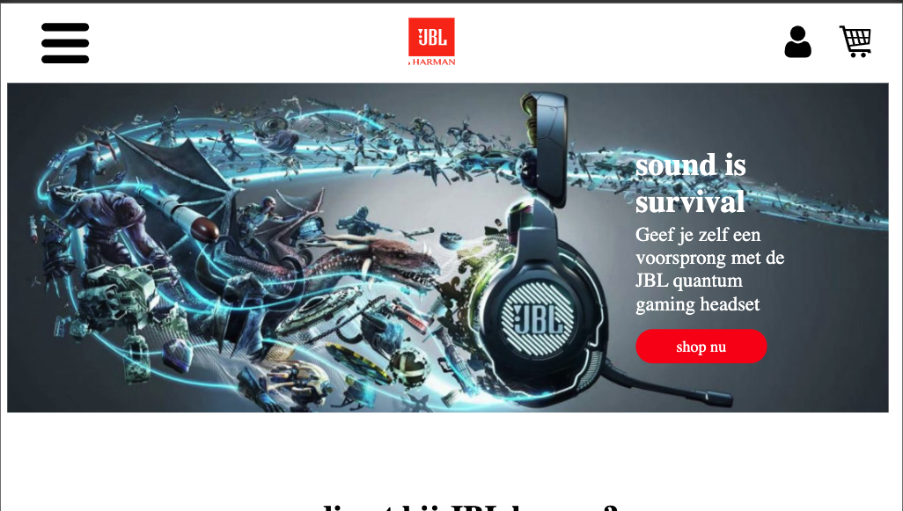
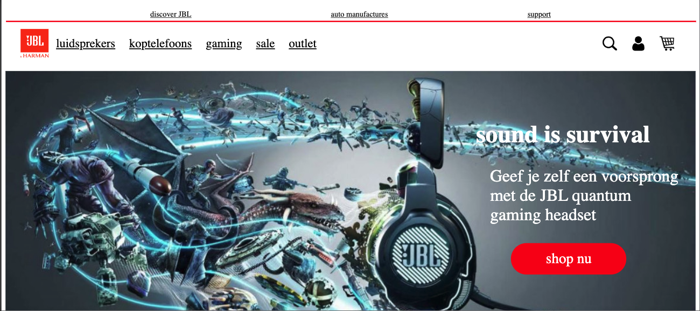

# Procesverslag
**Auteur:** -Ashley Keuning-

Markdown cheat cheet: [Hulp bij het schrijven van Markdown](https://github.com/adam-p/markdown-here/wiki/Markdown-Cheatsheet). Nb. de standaardstructuur en de spartaanse opmaak zijn helemaal prima. Het gaat om de inhoud van je procesverslag. Besteedt de tijd voor pracht en praal aan je website.

## Bronnenlijst
1. https://www.jbl.nl
2. dlo voor de opdrachten
3. Icons made by <a href="https://www.flaticon.com/authors/smashicons" title="Smashicons">Smashicons</a> from <a href="https://www.flaticon.com/" title="Flaticon"> www.flaticon.com</a>

Icons made by <a href="https://www.flaticon.com/authors/smashicons" title="Smashicons">Smashicons</a> from <a href="https://www.flaticon.com/" title="Flaticon"> www.flaticon.com</a>

Icons made by <a href="https://www.flaticon.com/authors/smashicons" title="Smashicons">Smashicons</a> from <a href="https://www.flaticon.com/" title="Flaticon"> www.flaticon.com </a>

Icons made by <a href="https://www.flaticon.com/authors/kiranshastry" title="Kiranshastry">Kiranshastry</a> from <a href="https://www.flaticon.com/" title="Flaticon"> www.flaticon.com</a>

Icons made by <a href="https://www.flaticon.com/authors/smashicons" title="Smashicons">Smashicons</a> from <a href="https://www.flaticon.com/" title="Flaticon"> www.flaticon.com</a>

Icons made by <a href="https://www.flaticon.com/authors/freepik" title="Freepik">Freepik</a> from <a href="https://www.flaticon.com/" title="Flaticon"> www.flaticon.com</a>

Icons made by <a href="https://www.flaticon.com/authors/freepik" title="Freepik">Freepik</a> from <a href="https://www.flaticon.com/" title="Flaticon"> www.flaticon.com</a>

Icons made by <a href="https://www.flaticon.com/authors/gregor-cresnar" title="Gregor Cresnar">Gregor Cresnar</a> from <a href="https://www.flaticon.com/" title="Flaticon"> www.flaticon.com</a>

Icons made by <a href="https://www.flaticon.com/authors/pixel-perfect" title="Pixel perfect">Pixel perfect</a> from <a href="https://www.flaticon.com/" title="Flaticon"> www.flaticon.com</a>

4. https://www.youtube.com/watch?v=wffK2OIt8u0
5. https://www.youtube.com/watch?v=alsxCvrbeko
6. https://codepen.io/joeaugie/pen/zYBvOJm
7. 

## Eindgesprek (week 7/8)

-dit ging goed & dit was lastig-

-ik had erg wat moeite met het positioneren van de detail pagina, aangezien er veel veranderd per device/maat, alleen heb ik uiteindelijk de sidebar op de detailpagina niet zo gekregen zoals ik het had willen gehad maar ik ben overal erg blij met mijn eindresultaat-

 

 

 

 

 

 

-screenshot(s) van je eindresultaat-
 

 

 

 

 

 

## Voortgang 3 (week 6)

-een paar dagen voor deze voortgang gesprek had ik besloten dat ik opnieuw ga beginnen, omdat mijn code erg onoverzichtelijk was en ik zelf mijn code niet meer begreep. deze week had ik weer een gesprek met danny en hij had twijfels over of ik dit wel ga redden en halen.-

## Voortgang 2 (week 5)

-dit keer had ik een gesprekje met de student assistenten,
ik liep erg achter vergeleken met de rest van mijn groepje, ik had ook weinig zicht op wat ik deed en wat er moest gebeuren. ik was ook niet veel verder dan de laatste voortgang gesprek. er werd mij deze week vertelt dat de gitbhub om de dag wel moest worden geupdate, dit wist ik niet en had ik dus ook niet gedaan.-

## Voortgang 1 (week 3)
-het ging rederlijkgoed deze week had ik een gesprek met danny, ik had alle html er in gezet en een beetje css, mijn eerste pagina was rederlijk af, 2de pagina moest nog gemaakt worden.-

### Stand van zaken

ik had in het begin erg veel moeite om weer intekomen met programeren/coderen, omdat ik dit al wat maanden niet heb gedaan was ik de basis dingen/elementen alweer vergeten, dit heb ik weer kunnen oppakken.

ik heb zelf moeite met het volgen van de lessen en opdrachten, dus loop ik iets achter, maar ik zorg dat ik dit weer op pak.

ik heb op dit moment moeite met de navigatie balk, deze bestaan bij mij uit iconen, het wat moeite met het positioneren.

voor derest moet ik nog content, linkjes, afbeeldingen op de juiste plek positioneren.

ik heb voor nu 1/3 van 1 pagina af, ik weet zelf dat ik erg aan de bak moet, maar dit komt goed.

**Screenshot(s):**

 

 

 

### Agenda voor meeting

-voor elke voortgang, zijn we op teams actief, we helpen elkaar als er vragen zijn-

### Verslag van meeting

-we gingen alleen chatten niet bellen en dit was ook niet echt nodig-

## Intake (week 1)

**Je startniveau:** ik heb al wel wat kennis maar ik ben ook geen pro, ik heb nog vooral moeite met javascript, html en css heb ik al wel goed onder de knie

**Je focus:**
ik kies uit responsive omdat ik dit graag wil leren en kunnen, als ik dit begrijp en onder de knie heb wil ik de surface plane nog proberen-

**Je opdracht:** 
https://www.jbl.nl 
- ik heb voor deze site gekozen, omdat ik zelf van muziek houd en wat Jbl producten zelf heb.

**Screenshot(s):**

**Breakdown-schets(en):**

![-voorlopige breakdownschets(en) van een of beide pagina's van de site die je gaat maken-]