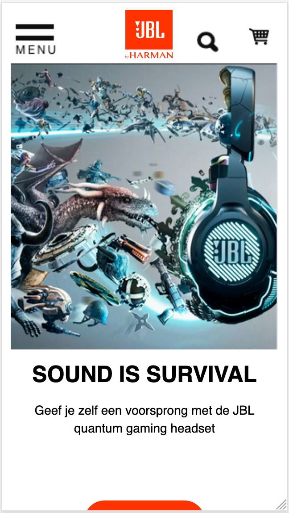
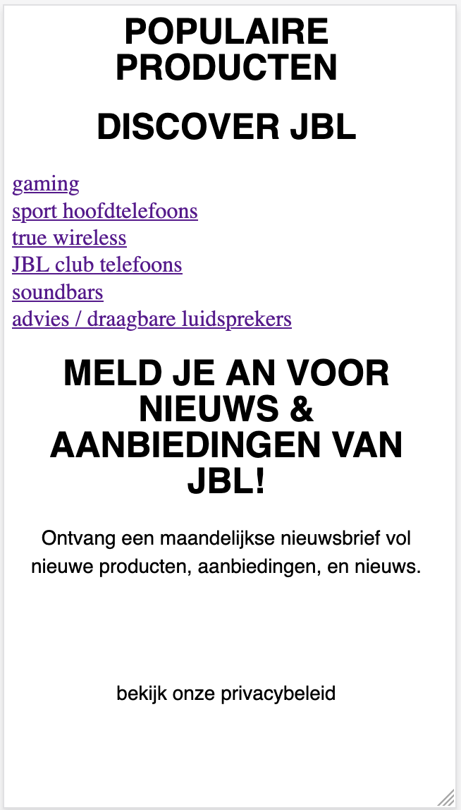
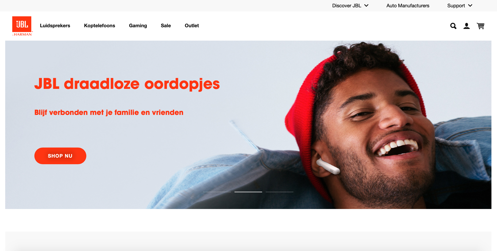

# Procesverslag
**Auteur:** -Ashley Keuning-

Markdown cheat cheet: [Hulp bij het schrijven van Markdown](https://github.com/adam-p/markdown-here/wiki/Markdown-Cheatsheet). Nb. de standaardstructuur en de spartaanse opmaak zijn helemaal prima. Het gaat om de inhoud van je procesverslag. Besteedt de tijd voor pracht en praal aan je website.

## Bronnenlijst
1. https://www.jbl.nl
2. -bron 2-
3. -...-

## Eindgesprek (week 7/8)

-dit ging goed & dit was lastig-

**Screenshot(s):**

-screenshot(s) van je eindresultaat-

## Voortgang 3 (week 6)

-same as voortgang 1-

## Voortgang 2 (week 5)

-same as voortgang 1-

## Voortgang 1 (week 3)

### Stand van zaken

ik had in het begin erg veel moeite om weer intekomen met programeren/coderen, omdat ik dit al wat maanden niet heb gedaan was ik de basis dingen/elementen alweer vergeten, dit heb ik weer kunnen oppakken.

ik heb zelf moeite met het volgen van de lessen en opdrachten, dus loop ik iets achter, maar ik zorg dat ik dit weer op pak.

ik heb op dit moment moeite met de navigatie balk, deze bestaan bij mij uit iconen, het wat moeite met het positioneren.

voor derest moet ik nog content, linkjes, afbeeldingen op de juiste plek positioneren.

ik heb voor nu 1/3 van 1 pagina af, ik weet zelf dat ik erg aan de bak moet, maar dit komt goed.

**Screenshot(s):**

 

 

 

### Agenda voor meeting

-samen met je groepje opstellen-

### Verslag van meeting

-na afloop snel uitkomsten vastleggen-

## Intake (week 1)

**Je startniveau:** ik heb al wel wat kennis maar ik ben ook geen pro, ik heb nog vooral moeite met javascript, html en css heb ik al wel goed onder de knie

**Je focus:**
ik kies uit responsive omdat ik dit graag wil leren en kunnen, als ik dit begrijp en onder de knie heb wil ik de surface plane nog proberen-

**Je opdracht:** 
https://www.jbl.nl 
- ik heb voor deze site gekozen, omdat ik zelf van muziek houd en wat Jbl producten zelf heb.

**Screenshot(s):**

**Breakdown-schets(en):**

![-voorlopige breakdownschets(en) van een of beide pagina's van de site die je gaat maken-]